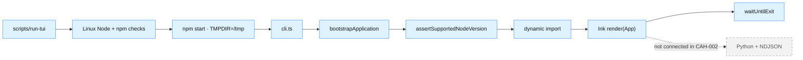
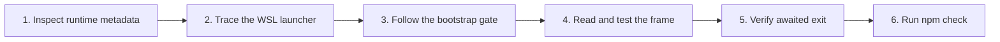

# CAH-002 lesson: Ink application shell

- **Unit:** CAH-002
- **Milestone:** M0 - Walking skeleton
- **Lesson status:** Verified against implementation
- **Implementation status:** Done; the static Ink shell, runtime guard, checks, and WSL lifecycle are
  verified
- **Story:** [CAH-002](../../user-stories/cah-002-bootstrap-ink-application.md)
- **Related architecture:** [ADR 0002](../adr/0002-ink-python-process-boundary.md) and
  [architecture overview](../architecture.md#process-boundary)
- **Visual companion:** [CAH-002 lesson deck](assets/cah-002-ink-application-shell.pptx)

> [!IMPORTANT]
> This lesson is verified against the implemented TypeScript shell, automated tests, and terminal
> evidence. It does not claim that a Python child, NDJSON protocol, session, model, workspace, tool,
> or policy exists.


*Concept illustration—not a screenshot. The layered shell represents the implemented terminal
frame remaining deliberately disconnected from Python and protocol behavior.*

## Quick summary

CAH-002 delivers a launchable conversation-first terminal frame inside Ubuntu WSL. A small shell
launcher rejects missing tooling, Windows Node or npm executables—including symlink-hidden targets—
and unsupported versions before npm; a pure TypeScript gate repeats Node validation before Ink is
imported. Ink then renders the title, empty conversation, task input, and idle status. Ctrl+C
unmounts the application and restores the terminal. The shell deliberately performs no task
submission or harness work.

### The unit in one view

| Established | Made observable | Deferred deliberately |
| --- | --- | --- |
| Node 22.22.1 pin and npm lockfile | Actionable WSL startup failures | Python child and NDJSON |
| TypeScript bootstrap before Ink import | Title, empty conversation, task input, status | Provider and agent loop |
| Awaited Ink exit lifecycle | Clean `Ctrl+C` terminal restoration | Tools, approvals, and policy |

## Learning objectives

After studying this unit, you should be able to:

- explain why runtime validation must occur before loading a terminal-rendering dependency;
- trace ownership from the WSL launcher through the TypeScript bootstrap to the Ink lifecycle;
- keep a Node pin, npm engine range, runtime guard, and lockfile consistent;
- test visible terminal content without coupling assertions to incidental whitespace; and
- distinguish a working interface shell from the deferred Python and protocol behavior behind it.

## Why this unit matters

The walking skeleton needs a real terminal owner before process supervision and protocol framing can
be debugged. CAH-002 isolates rendering, runtime compatibility, and terminal teardown so a later
child-process failure cannot be confused with a broken Ink setup.

It also turns architecture ownership into executable evidence. Ink owns the terminal frame and
Ctrl+C cleanup, while no React component makes session, orchestration, filesystem, tool, approval,
or policy decisions. The next unit can attach a Python child to a stable parent process rather than
building both boundaries at once.

## Key concepts

### Runtime validation precedes renderer loading

[`node-version.ts`](../../tui/src/node-version.ts) contains a pure compatibility check for the
supported `>=22.13.0 <23` range and the pinned 22.22.1 release.
[`bootstrap.ts`](../../tui/src/bootstrap.ts) runs that check before invoking an injected dynamic
loader. [`cli.ts`](../../tui/src/cli.ts) therefore imports `run-application.tsx` only after the
runtime is accepted, so an unsupported runtime cannot enter Ink's render path.

### The launcher owns pre-Node WSL failures

[`scripts/run-tui`](../../scripts/run-tui) runs before TypeScript can help. It reports actionable
instructions when Node or npm is absent, resolves both executable paths with `readlink -f`, rejects
a raw or resolved `/mnt` or `.exe` path, and validates `>=22.13.0 <23` before npm can load `tsx`. It
then resolves the repository root and launches the npm start script without depending on the
caller's current directory. The TypeScript gate repeats the range check as defense in depth for
direct CLI callers.

### A lockfile and metadata form one runtime contract

`.node-version` pins 22.22.1, `tui/package.json` declares `>=22.13.0 <23` and npm 9 or newer, and
`tui/.npmrc` enables `engine-strict`. The committed `package-lock.json` fixes Ink 7.1.0, React 19.2.7,
and the development toolchain. A metadata test compares the pin and engine declaration with the
constants enforced by the bootstrap so these representations cannot drift silently.

### Terminal exit is an awaited lifecycle

[`run-application.tsx`](../../tui/src/run-application.tsx) renders with `exitOnCtrlC: true` and awaits
Ink's `waitUntilExit()`. The CLI does not treat render invocation as completion; it stays alive until
Ink has unmounted and restored the terminal.

### Render tests assert meaning, not decoration

[`app.test.tsx`](../../tui/test/app.test.tsx) checks the stable labels and their semantic order. It
does not snapshot border characters, color codes, or exact spacing, so harmless presentation changes
do not hide the contract being tested.

## Architecture and design



| Concern | Implemented owner | Evidence |
| --- | --- | --- |
| Missing, Windows, symlink-hidden, or unsupported outer runtime | `scripts/run-tui` | `launcher.test.ts` |
| Version compatibility defense in depth | `node-version.ts` | `node-version.test.ts`, `runtime-metadata.test.ts` |
| Pre-render ordering | `bootstrap.ts` | `bootstrap.test.ts` |
| Initial visible frame | `app.tsx` | `app.test.tsx` |
| Ctrl+C and awaited teardown | `run-application.tsx` | `run-application.test.tsx`, manual PTY check |
| npm scripts and dependency resolution | `package.json`, `.npmrc`, `package-lock.json` | `npm ci`, `npm run check` |

### Verified terminal composition

The exact borders and spacing remain Ink rendering details. The labels and their semantic order are
implemented in `app.tsx` and asserted in `app.test.tsx`.

```text
╭──────────────────────────────────────────────────────────────────────╮
│ Code Assist Harness                                                  │
│                                                                      │
│ Conversation                                                         │
│ ╭──────────────────────────────────────────────────────────────────╮ │
│ │ No messages yet.                                                 │ │
│ ╰──────────────────────────────────────────────────────────────────╯ │
│                                                                      │
│ Task input                                                           │
│ ╭──────────────────────────────────────────────────────────────────╮ │
│ │ Input is not connected in this static shell.                     │ │
│ ╰──────────────────────────────────────────────────────────────────╯ │
│                                                                      │
│ Status: idle · runtime not connected · Ctrl+C to exit                │
╰──────────────────────────────────────────────────────────────────────╯
```

The implemented invariants are:

- unsupported Node versions fail before npm and are rechecked before the Ink-owning module loads;
- missing tooling and raw or symlink-hidden Windows Node/npm paths fail with WSL setup guidance;
- the repository pin, npm engine range, and TypeScript guard stay aligned;
- the screen contains the title, conversation empty state, task-input placeholder, and idle status;
- Ctrl+C remains an Ink-owned application exit because no active session exists yet;
- the CLI waits for terminal cleanup before settling;
- start and test use the Linux `/tmp` directory rather than inherited invalid Windows temp paths;
- type checking, linting, and tests use installed local dependencies without model or network access;
  and
- no Python child, protocol, provider, workspace, tool, transcript, approval, or policy behavior is
  present.

## Practical walkthrough



1. **Inspect the runtime contract.** `.node-version` contains 22.22.1. `package.json` accepts
   `>=22.13.0 <23`, requires npm 9 or newer, and `tui/.npmrc` makes engine mismatches fatal.
2. **Start at the launcher.** `scripts/run-tui` checks for Node and npm, resolves both executable
   paths, rejects raw or symlink-hidden Windows binaries and unsupported versions, finds the
   repository root, and executes the TUI's `start` script.
3. **Follow the bootstrap.** `cli.ts` passes `process.versions.node` to `bootstrapApplication` and
   supplies a dynamic import. An error is written to stderr with exit status 1.
4. **Study the pure guard.** `assertSupportedNodeVersion` accepts an explicit value, enabling edge
   cases to be tested without replacing the developer's active Node installation.
5. **Render the shell.** `App` uses a vertical layout with `Code Assist Harness`, `Conversation`,
   `No messages yet.`, `Task input`, and `Status: idle` regions. Input is visibly disconnected in
   this unit.
6. **Trace exit ownership.** `runApplication` asks Ink to handle Ctrl+C and awaits `waitUntilExit`.
   The lifecycle test verifies both arguments; a pseudo-terminal run verified the physical cleanup.
7. **Run the focused suite.** Six test files contain 17 tests covering the screen, bootstrap order,
   launcher failure, version boundaries, runtime metadata, and exit configuration.
8. **Reproduce the environment lesson.** In the implementation WSL session, inherited `TEMP` and
   `TMP` named a missing Windows directory. The `start` and `test` scripts now set `TMPDIR=/tmp`,
   keeping Ink and Vitest temporary files on a valid Linux path.
9. **Run the checks.** `npm --prefix tui run check` combines type checking, linting, and the
   non-watch test run. The existing Python checks remain independent and passing.

The exact command results and terminal observation are preserved in the
[completion note](../../user-stories/notes/2026-07-15-cah-002-ink-shell.md).

## Failure scenarios to study

| Failure | Responsible boundary | Safe outcome | Evidence |
| --- | --- | --- | --- |
| Node or npm is missing, unsupported, Windows-hosted, or hidden behind a symlink | `scripts/run-tui` | Exit before npm or Ink with the detected path or version and WSL setup commands | `launcher.test.ts` |
| A direct CLI caller uses an unsupported runtime | `node-version.ts`, `bootstrap.ts` | Reject the value without importing Ink | Version cases and rejected-loader assertion |
| Runtime metadata drifts | `.node-version`, package metadata, constants | Fail before publishing an inconsistent setup path | `runtime-metadata.test.ts` |
| Ctrl+C leaves a damaged prompt | `run-application.tsx` | Let Ink unmount and await `waitUntilExit` | Lifecycle test and manual PTY check |
| WSL inherits a nonexistent Windows temporary directory | npm start and test scripts | Set `TMPDIR=/tmp` narrowly | Reproduced failure and passing scripts |

The launcher tests cover a missing executable, a fake Node 20 whose fake npm remains uncalled, a
Windows npm target, and a Linux-looking Node symlink that hides a Windows executable target. The
TypeScript tests separately prove malformed, older, and newer runtimes cannot enter the renderer.

## Production expansion

### Example enterprise scenario

Suppose a terminal client is distributed to thousands of engineers across several supported Linux
distributions, with staged releases, accessibility expectations, support telemetry, and older
terminal emulators. Rendering remains one component, but packaging and support become products of
their own.

### Typical production capabilities and tools

- [Ink](https://github.com/vadimdemedes/ink) represents component-based terminal rendering, while
  adding React and Node dependency upgrades plus terminal-compatibility testing.
- [ink-testing-library](https://github.com/vadimdemedes/ink-testing-library) represents isolated
  rendering and input tests for terminal components, but fixtures and render assertions must track
  Ink and terminal behavior.
- [npm lockfiles](https://docs.npmjs.com/cli/v11/configuring-npm/package-lock-json/) represent
  repeatable dependency resolution and CI installation, at the cost of dependency-update review and
  ongoing security patching.
- [OpenTelemetry for JavaScript](https://opentelemetry.io/docs/languages/js/) represents optional
  support telemetry, while instrumentation, collector or backend operation, and privacy review add
  ongoing cost.

These tools illustrate capabilities; telemetry is not an MVP dependency or endorsement.

### Local design versus production design

| Dimension | This repository | Production expansion |
| --- | --- | --- |
| Platform | One pinned Node line inside Ubuntu WSL | Tested terminal, runtime, and OS support matrix |
| Distribution | Run from one checkout and lockfile | Signed packages and staged release channels |
| Rendering tests | Six focused local test files | Compatibility, resize, input, and accessibility suites |
| Diagnostics | Actionable stderr and manual PTY evidence | Support bundles, privacy-reviewed telemetry, and SLOs |
| Cost | One npm project and direct terminal validation | Packaging, telemetry, release, and support ownership |

### Trade-offs and graduation signals

The local launcher and TypeScript bootstrap deliberately split responsibility. The shell script can
diagnose failures that occur before Node exists, while the pure TypeScript guard keeps compatibility
logic testable and prevents Ink from loading early. That extra seam is justified by clearer startup
failures. Pinning one Node release improves reproducibility but creates deliberate upgrade work.

Setting `TMPDIR=/tmp` is a narrow WSL correction rather than general environment normalization. The
static task-input placeholder keeps CAH-002 honest, but CAH-005 must replace it with real local input
and protocol submission. Wider distribution becomes worthwhile only when real users, recurring
terminal incompatibilities, accessibility requirements, or release rollback needs justify the
additional platform and support cost.

## Practical exercises

1. Add one unsupported version case and predict whether the application loader should be called.
2. Change a stable screen label and observe the semantic render test fail without a snapshot diff.
3. Temporarily mismatch `.node-version` and `SUPPORTED_NODE_RANGE`, then identify which metadata
   assertion detects the drift.
4. Trace Ctrl+C from Ink's render option through `waitUntilExit` and explain why the CLI awaits it.
5. Compare the responsibilities of `scripts/run-tui` and `node-version.ts`; identify which failures
   cannot be handled inside TypeScript.

## Key takeaways

- The WSL launcher handles failures that exist before TypeScript can run.
- A pure gate plus dynamic import proves unsupported Node cannot enter the Ink renderer.
- Semantic frame tests and an awaited Ctrl+C lifecycle establish a dependable terminal parent.
- Runtime metadata is one contract spread across a pin, npm configuration, code, and tests.
- CAH-002 ships a real interface shell, not a Python runtime or agent.

## Glossary

- **Bootstrap gate:** Validation that must succeed before the renderer-owning module is loaded.
- **Dynamic import seam:** An injectable deferred import that makes module-loading order testable.
- **Frame:** The current terminal output produced by Ink.
- **Projection:** UI state derived from behavior owned elsewhere; the TUI displays it but does not
  become its source of authority.
- **Render test:** A test that inspects user-visible terminal content without a physical TTY.
- **Runtime pin:** The exact Node release selected in `.node-version` for reproducible development.
- **Terminal lifecycle:** Rendering, Ctrl+C handling, unmounting, and restoration before process exit.

See the shared [project glossary](../glossary.md) for TUI, runtime, event, and policy terms.

## Further reading

- [CAH-002 delivery contract](../../user-stories/cah-002-bootstrap-ink-application.md)
- [CAH-002 completion evidence](../../user-stories/notes/2026-07-15-cah-002-ink-shell.md)
- [CAH-002 visual lesson deck](assets/cah-002-ink-application-shell.pptx)
- [ADR 0002: Ink and Python process boundary](../adr/0002-ink-python-process-boundary.md)
- [Architecture process boundary](../architecture.md#process-boundary)
- [Ink documentation](https://github.com/vadimdemedes/ink)
- [ink-testing-library documentation](https://github.com/vadimdemedes/ink-testing-library)
- [npm package-lock documentation](https://docs.npmjs.com/cli/v11/configuring-npm/package-lock-json/)
- [OpenTelemetry for JavaScript](https://opentelemetry.io/docs/languages/js/)
