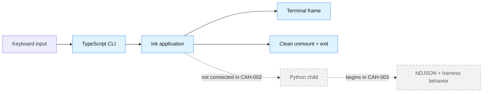
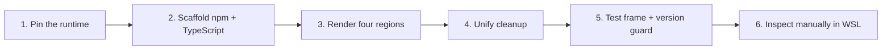

# CAH-002 lesson: Ink application shell

- **Unit:** CAH-002
- **Milestone:** M0 - Walking skeleton
- **Lesson status:** Planned
- **Implementation status:** Planned; no `tui/` project, Node pin, or Ink screen exists yet
- **Story:** [CAH-002](../../user-stories/cah-002-bootstrap-ink-application.md)
- **Related architecture:** [ADR 0002](../adr/0002-ink-python-process-boundary.md) and
  [architecture overview](../architecture.md#process-boundary)
- **Visual companion:** [CAH-002 lesson deck](assets/cah-002-ink-application-shell.pptx)

> [!IMPORTANT]
> This lesson explains accepted process ownership and planned CAH-002 behavior. The illustration,
> screen composition, and walkthrough below are design aids—not evidence of a shipped TUI. Python
> child startup begins in CAH-003.


*Concept illustration: CAH-002 assembles the terminal frame before any backend process, protocol,
provider, or tool is connected.*

## Quick summary

CAH-002 builds a static TypeScript/Ink shell that will eventually project harness events. The unit
deliberately proves only three contracts: repeatable Node tooling, a testable terminal frame, and a
clean terminal exit.

That small scope is the lesson. Rendering and lifecycle failures become observable before Python,
NDJSON, model, and policy behavior can obscure their cause.

### The unit in one view

| Establish now | Make observable | Defer deliberately |
| --- | --- | --- |
| Node version and npm lockfile | Title, empty state, input, status | Python child and NDJSON |
| TypeScript/Ink application shell | Unsupported-runtime error | Provider and agent loop |
| One terminal cleanup path | Clean `Ctrl+C` exit | Tools, approvals, and policy |

## Learning objectives

After completing this unit, you should be able to:

- explain how an Ink renderer owns a terminal frame and keyboard input;
- keep presentation contracts separate from orchestration and safety decisions;
- pin and enforce a compatible Node runtime with an npm lockfile;
- design a render test around user-visible regions instead of incidental whitespace; and
- trace normal exit through one cleanup path that restores the terminal.

## Why this unit matters

The walking skeleton needs a real terminal parent before process and protocol complexity arrives.
Building the shell independently makes rendering and lifecycle bugs diagnosable without confusing
them with child-process failures or malformed events.

It also establishes a lasting ownership rule:

> **Ink projects state and captures input. Python will decide what the state means and whether an
> action is safe.**

## Key concepts

### Ink is a renderer, not the harness

Ink maps React components to terminal output. Components render conversation, input, and status;
they do not acquire provider, filesystem, command-policy, or session-authority responsibilities.

### A terminal frame is transient state

Interactive output is repeatedly redrawn. Cleanup must unmount the application and restore cursor
and input behavior, especially on `Ctrl+C`, rather than treating exit like printing one final line.

### Runtime pinning makes failures intentional

The selected Ink release determines a compatible Node range. A repository version file and
`package.json` engine metadata should agree, while an early check turns incompatibility into an
actionable message before React renders.

### A lockfile records dependency resolution

`package-lock.json` captures the dependency graph installed by npm. Committing it lets CI use
`npm ci` and separates deliberate upgrades from incidental resolution drift.

### Render tests assert user-observable contracts

The initial test should check the title, empty conversation state, input area, and status line. It
should avoid snapshots of incidental whitespace unless spacing itself is the behavior under test.

## Architecture and design

The first useful boundary is intentionally one process wide:



| Concern | CAH-002 owner | Deferred owner |
| --- | --- | --- |
| Terminal rendering and input | Ink application | — |
| Node compatibility check | TUI CLI bootstrap | — |
| Python process lifetime | Not present | CAH-003 supervisor |
| Wire parsing | Not present | CAH-004 protocol boundary |
| Session and policy decisions | Not present | Python harness core |

### Planned terminal composition

The acceptance criteria call for four visible regions. The exact copy and spacing remain an
implementation choice; this diagram only makes the planned contract tangible.

```text
╭──────────────────────────────────────────────────────────╮
│ Code Assist Harness                              CAH-002 │  title
├──────────────────────────────────────────────────────────┤
│                                                          │
│                 No conversation yet                      │  conversation
│                                                          │
├──────────────────────────────────────────────────────────┤
│ ›                                                        │  input
├──────────────────────────────────────────────────────────┤
│ idle                                                     │  status
╰──────────────────────────────────────────────────────────╯
```

The planned invariants are:

- production TUI code is TypeScript and meaningful exports use TSDoc;
- unsupported Node versions fail before terminal rendering begins;
- `Ctrl+C` exits cleanly without leaving rendering artifacts;
- components do not invent session, policy, or approval authority;
- initial screen behavior has a focused `ink-testing-library` test; and
- type checking, linting, and tests need no network or model access.

## Practical walkthrough



1. **Choose the compatible runtime.** At implementation time, confirm the selected stable Ink
   package's Node requirement. Add one repository version pin and a matching `engines.node` range.
2. **Create `tui/package.json`.** Use npm scripts for launch, type checking, linting, and tests.
   Commit the resulting `package-lock.json`; avoid a monorepo orchestrator for this slice.
3. **Configure TypeScript.** Keep the CLI entry, application component, and tests type checked.
   Define whether JSX and module settings match the selected Node and test runner versions.
4. **Build the static shell.** Render an application title, empty conversation area, input area,
   and status line. The status may be a local static value such as `idle` in this story.
5. **Handle exit.** Connect `Ctrl+C` to one cleanup path that unmounts Ink and exits successfully.
   Document any exported keyboard contract with TSDoc.
6. **Test the frame.** Render the app with `ink-testing-library`, inspect the last frame, and assert
   the important labels and empty state.
7. **Test the version guard.** Inject or isolate a fake unsupported version; never require a
   developer to replace their active Node installation to exercise the failure.
8. **Validate manually in WSL.** Launch with the documented command, resize if useful, and confirm
   exit returns the cursor and prompt to normal.

## Failure scenarios to study

### Unsupported Node fails deep inside Ink

| Signal | Responsible boundary | Safe outcome | Evidence |
| --- | --- | --- | --- |
| Syntax or module-loader error before the screen | CLI bootstrap | Reject the runtime first and show the supported range plus setup action | Isolated unsupported-version test |

### `Ctrl+C` leaves a damaged prompt

| Signal | Responsible boundary | Safe outcome | Evidence |
| --- | --- | --- | --- |
| Hidden cursor or prompt overwriting the final frame | Ink lifecycle cleanup | Unmount once, restore terminal state, and exit | Cleanup test plus manual WSL check |

These failures look unrelated, but both teach the same lesson: establish the boundary before asking
the application to do more work.

## Production expansion

### Example enterprise scenario

Suppose a terminal client is distributed to thousands of engineers across several supported Linux
distributions, with staged releases, accessibility expectations, support telemetry, and older
terminal emulators. Rendering remains one component, but packaging and support become products of
their own.

### Typical production capabilities and tools

- [Ink](https://github.com/vadimdemedes/ink) represents component-based terminal rendering, while
  adding React and Node dependency upgrades plus terminal-compatibility testing.
- [ink-testing-library](https://github.com/vadimdemedes/ink-testing-library) represents isolated
  rendering and input tests for terminal components, but fixtures and render assertions must track
  Ink and terminal behavior.
- [npm lockfiles](https://docs.npmjs.com/cli/v11/configuring-npm/package-lock-json/) represent
  repeatable dependency resolution and CI installation, at the cost of dependency-update review
  and ongoing security patching.
- [OpenTelemetry for JavaScript](https://opentelemetry.io/docs/languages/js/) represents optional
  support telemetry, while instrumentation, collector or backend operation, and privacy review add
  ongoing cost.

These tools illustrate capabilities; the last capability is not an MVP dependency or endorsement.

### Local design versus production design

| Dimension | This repository | Production expansion |
| --- | --- | --- |
| Platform | Ubuntu under WSL | Tested terminal and OS support matrix |
| Distribution | Run from one checkout | Signed packages and staged release channels |
| Rendering tests | Focused initial frame | Compatibility, resize, input, and accessibility suites |
| Cost | One npm project and lockfile | Packaging, telemetry, release, and support ownership |

### Trade-offs and graduation signals

Wider distribution improves accessibility and supportability but multiplies terminal, OS, upgrade,
and privacy requirements. Graduate when there are real external users, recurring environment bugs,
or release rollback needs—not simply because production tools exist.

## Practical exercises

1. Label each box in the planned terminal composition as presentation state, user input, or
   lifecycle state. Which labels still need a Python event in a later story?
2. Write an assertion set that survives color or spacing changes but detects a missing status line.
3. Model an unsupported Node check as a pure function and list the fields that make its error
   actionable.
4. Trace `Ctrl+C` from keypress to restored prompt. Where would a second exit call cause trouble?

## Key takeaways

- Ink owns terminal projection and input, not agent orchestration or safety policy.
- Runtime compatibility and clean terminal teardown are user-visible contracts.
- A static, model-free shell isolates failures before the cross-process boundary exists.

## Glossary

- **Frame:** The current terminal output produced by the renderer.
- **Projection:** UI state derived from behavior owned elsewhere; the TUI displays it but does not
  become its source of authority.
- **Render test:** A test that inspects terminal output from components without a physical TTY.
- **Runtime pin:** Repository metadata selecting a supported Node version.
- **Terminal lifecycle:** Setup, input handling, rendering, unmounting, and restoration on exit.

See the shared [project glossary](../glossary.md) for TUI, runtime, event, and policy terms.

## Further reading

- [CAH-002 delivery contract](../../user-stories/cah-002-bootstrap-ink-application.md)
- [CAH-002 visual lesson deck](assets/cah-002-ink-application-shell.pptx)
- [ADR 0002: Ink and Python process boundary](../adr/0002-ink-python-process-boundary.md)
- [Ink documentation](https://github.com/vadimdemedes/ink)
- [ink-testing-library documentation](https://github.com/vadimdemedes/ink-testing-library)
- [npm package-lock documentation](https://docs.npmjs.com/cli/v11/configuring-npm/package-lock-json/)
- [OpenTelemetry for JavaScript](https://opentelemetry.io/docs/languages/js/)
